<div>
  
  
</div>
<div style="display: inline_block"><br>
  
  
  
  
  
  
  
  
  
  
  
  
</div>

##

<div>
<a href = "https://blog.hentioe.dev/"></a>
<a href = "https://www.zhihu.com/people/Hentioe"></a>
<a href = "https://t.me/Hentioe"></a>
</div>

## About Me

Hi, I'm Hentioe, a professional and personal developer living in China. Used to work in Shanghai, now in Shenzhen.

Since I became a full-time independent developer, I've used **Elixir** and **Rust** extensively as base programming languages, and have acquired a very rich technology stack and experience across various domains.

Elixir and Rust are my main areas of research, but that doesn't mean I haven't worked with other languages. In fact, in my previous work, I've mainly worked with more mainstream languages such as Java, Ruby, and Golang.

## Contact Me

Over the past few years, I managed to develop (or participate in the development of) several software products for companies/individuals all over the world (Singapore/USA/Europe). Especially in the areas of Telegram, blockchain, cloud computing, etc., in-house infrastructure framework development and design, etc.

Feel free to contact me, I accept remote work.

## Recommend

Here are some recommended projects beyond the pinned list:

- [Axiom](https://github.com/Hentioe/axiom): AI chat adapter library written in Elixir
- [Miragend](https://github.com/Hentioe/miragend): Universal reverse proxy for fighting AI and illegal crawlers
- [thumbhash-ex](https://github.com/Hentioe/thumbhash-ex): Pure Elixir implementation of ThumbHash
- [Honeycomb](https://github.com/Hentioe/honeycomb): Another scheduling system, focusing on the collection of results for one-time tasks, written in Elixir
- [dockerized-apps](https://github.com/Hentioe/dockerized-apps): My dockerized apps
- [dotfiles](https://github.com/Hentioe/dotfiles): Hentioe's configurations

Here are some recommended blog posts:

<!-- BLOG-POST-LIST:START -->

- [现代化 C 语言替代：认识 Zig 语言](https://blog.hentioe.dev/posts/modern-c-language-alternative-introducing-zig-language.html)
- [番茄钟：Tauri 跨端应用开发前景的强大展现力](https://blog.hentioe.dev/posts/pomodoro-clock-tauri-application-prospects.html)
- [OpenAmber 项目介绍：自动登记系统「喵星备案」的开源实现](https://blog.hentioe.dev/posts/open-amber.html)
- [Elixir 入门篇：认识 Elixir](https://blog.hentioe.dev/posts/elixir-getting-started-understanding-elixir.html)
- [Axiom Chat 机器人使用指南](https://blog.hentioe.dev/posts/axiom-chat-bot.html)
<!-- BLOG-POST-LIST:END -->

## Donation Addresses

**BSC / POLYGON / Arbitrum**:

```plaintext
0xae96e9225B9324688D6d93118a9a6001042c7965
```

**TRON**:

```plaintext
TTekQLBz2CY4CvB8xdhpyQZCcKsk4BPhxm
```

**TON**:

```plaintext
UQAofsJ_4o0wdbm0e-d0eYkHEsU7xzzY1oxIBLx1qK3as9hh
```
